# Documentación Complementaria: Plataforma Open Fiber

## Índice
1. [Introducción](#introducción)
2. [Diagramas de Flujo de Procesos](#diagramas-de-flujo-de-procesos)
   - [Sistema de Usuarios y Autenticación](#sistema-de-usuarios-y-autenticación)
   - [Sistema de Proyectos y Máquinas](#sistema-de-proyectos-y-máquinas)
   - [Sistema Educativo](#sistema-educativo)
3. [Diagrama de Base de Datos](#diagrama-de-base-de-datos)
4. [Diagramas de Actividad](#diagramas-de-actividad)
   - [Proceso de Registro y Onboarding](#proceso-de-registro-y-onboarding)
   - [Proceso de Creación de Versiones](#proceso-de-creación-de-versiones)
   - [Proceso de Creación de Cursos](#proceso-de-creación-de-cursos)
5. [Diagramas de Secuencia](#diagramas-de-secuencia)
   - [Interacción de Aprobación de Versiones](#interacción-de-aprobación-de-versiones)
   - [Proceso de Creación de Organizaciones](#proceso-de-creación-de-organizaciones)
6. [Diagrama de Componentes](#diagrama-de-componentes)
7. [Diagrama de Estados](#diagrama-de-estados)
   - [Estados de una Máquina/Proyecto](#estados-de-una-máquinaproyecto)
   - [Estados de una Solicitud de Organización](#estados-de-una-solicitud-de-organización)

## Introducción

Este documento complementa la documentación detallada de la plataforma Open Fiber, proporcionando diagramas técnicos y visualizaciones de los principales flujos de procesos, estructuras de datos y comportamientos del sistema. Los diagramas están en formato Mermaid para facilitar su integración en entornos GitHub y otras plataformas de documentación técnica.

Open Fiber, como repositorio colaborativo de proyectos maker, necesita una representación visual clara de sus componentes y flujos para facilitar la comprensión de su arquitectura y funcionamiento tanto para desarrolladores como para usuarios técnicos.

## Diagramas de Flujo de Procesos

### Sistema de Usuarios y Autenticación

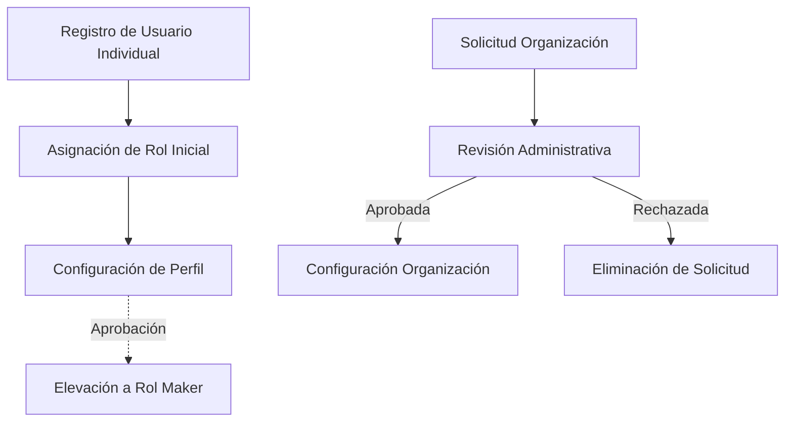

### Sistema de Proyectos y Máquinas

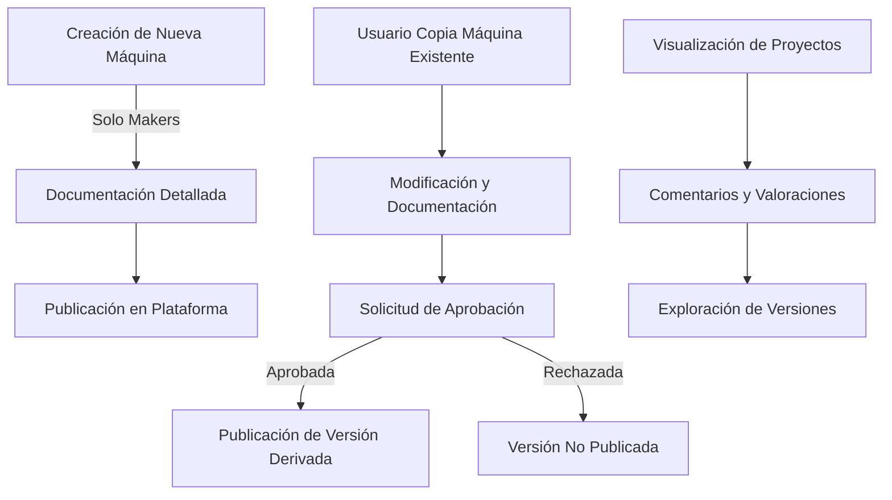

### Sistema Educativo

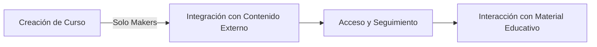

## Diagrama de Base de Datos

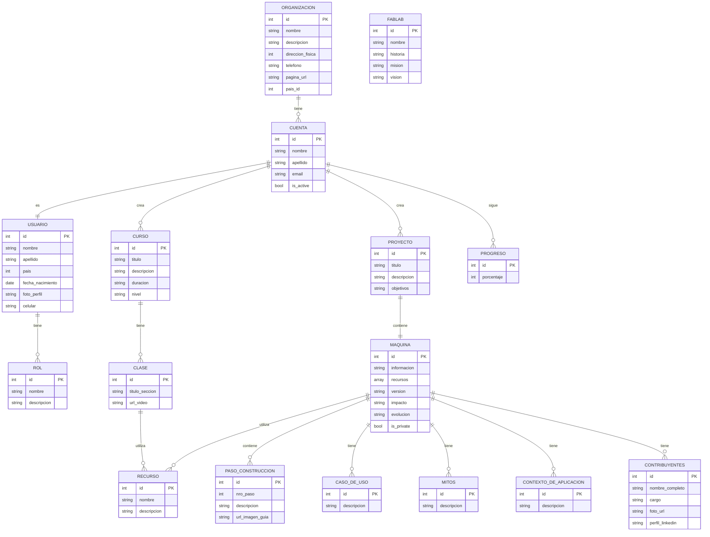

## Diagramas de Actividad

### Proceso de Registro y Onboarding

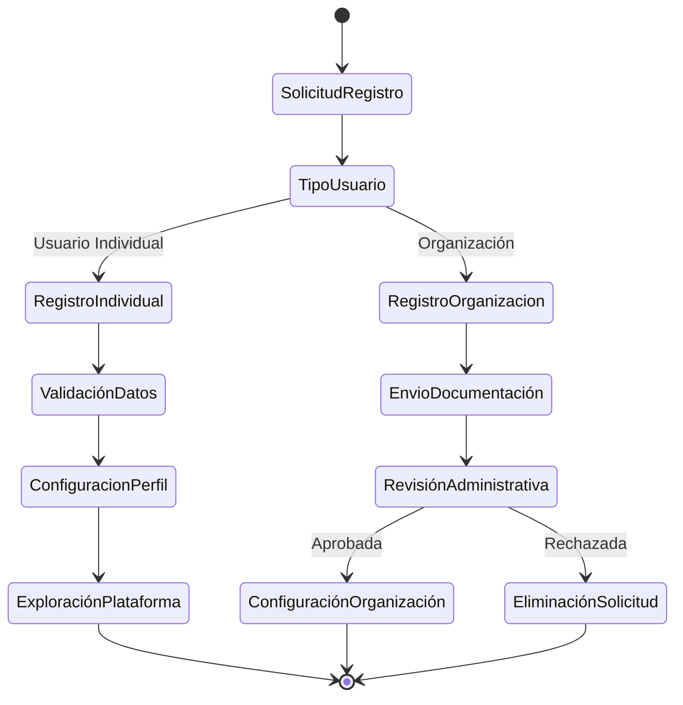

### Proceso de Creación de Versiones

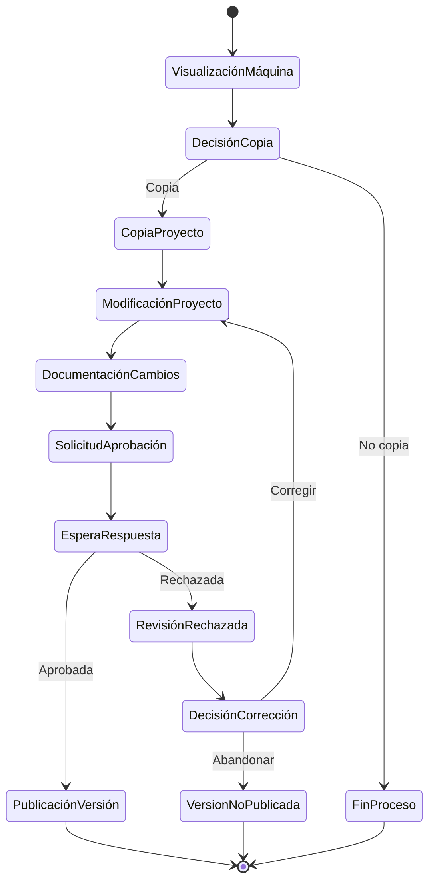

### Proceso de Creación de Cursos

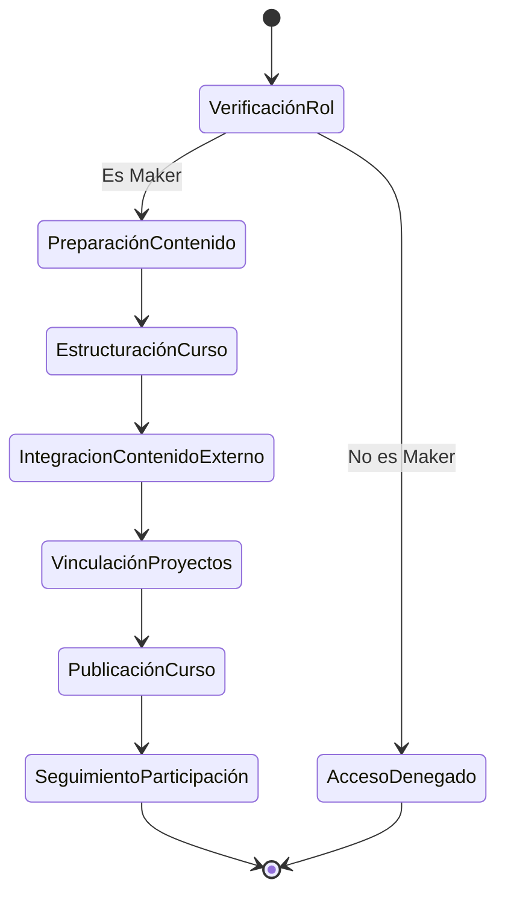

## Diagramas de Secuencia

### Interacción de Aprobación de Versiones

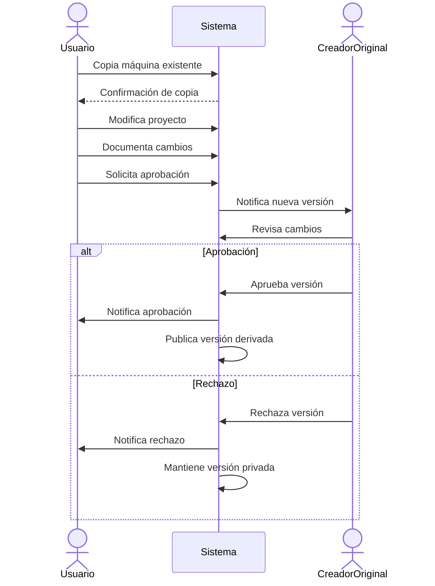

### Proceso de Creación de Organizaciones

```mermaid
sequenceDiagram
    actor Solicitante
    participant Sistema
    actor Administrador
    
    Solicitante->>Sistema: Solicita registro como organización
    Sistema-->>Solicitante: Solicita documentación
    
    Solicitante->>Sistema: Envía documentación verificable
    Sistema->>Administrador: Notifica nueva solicitud
    
    Administrador->>Sistema: Revisa documentación
    
    alt Aprobación
        Administrador->>Sistema: Aprueba solicitud
        Sistema->>Solicitante: Notifica aprobación
        Sistema->>Sistema: Crea cuenta de organización
    else Rechazo
        Administrador->>Sistema: Rechaza solicitud
        Sistema->>Solicitante: Notifica rechazo
        Sistema->>Sistema: Elimina solicitud temporal
    end
```

## Diagrama de Componentes

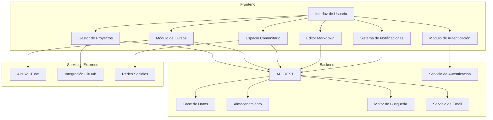

## Diagrama de Estados

### Estados de una Máquina/Proyecto

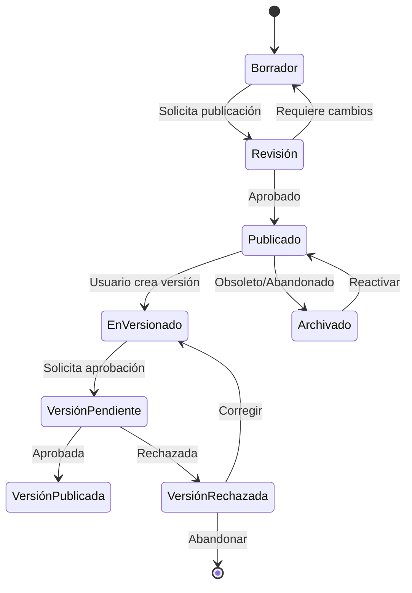

### Estados de una Solicitud de Organización

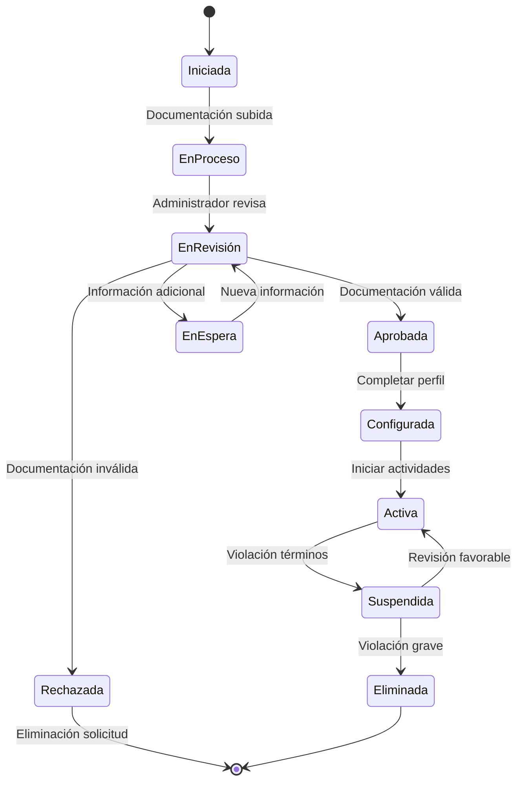